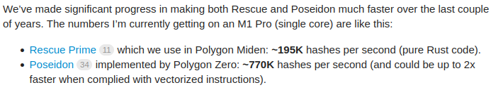

# ZKEVM

- https://zkevm.polygon.technology

## Stark
- https://starkware.co/stark-101/

## Main state machine

- various computations pertaining to transactions submitted by users to the Polygon zkEVM network
- generates fixed-length, easy-to-verify cryptographic proofs of Computational Integrity (CI).
  - These proofs can be verified by spending only a minimal amount of computational resources.
  - these proofs are **STARK** proofs that are recursively aggregated into one **STARK** proof, which is in turn proved with a **SNARK** proof
- https://docs.polygon.technology/zkEVM/architecture/zkprover/main-state-machine/

## zk friendly hash

STARK-friendly hash functions (SFH) are hash functions which are specified as a sequence of low-degree polynomials or low-degree rational maps over a finite field

- https://docs.polygon.technology/zkEVM/architecture/zkprover/hashing-state-machines/
- https://eips.ethereum.org/assets/eip-5988/papers/report_security_stark_friendly_hash.pdf
- https://affine.group/2020/02/starkware-challenge

By Polygon research
- https://eprint.iacr.org/2023/1045.pdf : XHash8 and XHash12: Efficient STARK-friendly Hash Functions
- https://github.com/0xPolygonMiden/crypto/blob/next/benches/README.md : Miden VM Hash

## Rescue
  - https://eprint.iacr.org/2020/820.pdf
  - https://github.com/matter-labs/rescue-poseidon
  - https://github.com/facebook/winterfell/blob/589154687007a572683e7f565b46ac7f725a5df2/crypto/src/hash/rescue/rp64_256/mod.rs#L61
  - https://eprint.iacr.org/2020/1143.pdf

## Vision
- https://pdfs.semanticscholar.org/a74f/69cb8548da978c8760608e6aba7502b5b4b2.pdf

### Upgrades
- https://docs.polygon.technology/zkEVM/architecture/protocol/upgradability/#deploying-battle-tested-contracts
- https://docs.polygon.technology/zkEVM/architecture/protocol/admin-role/
- https://docs.polygon.technology/zkEVM/architecture/protocol/upgrade-process/

time delay set for a zkEVM’s upgrade is 10 days by using timelock contract

## Comparisions

- Rescue vs Poseidon
  - https://ethresear.ch/t/performance-of-rescue-and-poseidon-hash-functions/7161
    - These results are from for Intel Core i5-7300U @ 2.60GHz (single thread):
      - Rescue: ~12,000 hashes/second or ~80,000 ns / hash
      - Poseidon: ~33,000 hashes/second or ~30,000 ns / hash

- Posedon issue : https://eprint.iacr.org/2023/1045.pdf

There are multiple hash functions designed for ZK-proof systems. Poseidon is an
efficient hash function that is widely used. The partial layers in the design of Poseidon were subject
to multiple attacks [KR21a, BCD+20] subsequently leading to updating the parameters. Recently,
in [ABM23a] the authors analyzed the security of Poseidon and showed that in some synthetic cases,
the number of rounds proposed for providing a specific security level is insufficient. In the same work,
the authors showed some flaws in the security proof of Poseidon. Recently, a new version of Poseidon,
called Poseidon2 [GKS23] was published to improve the efficiency of Poseidon but without correcting
the flaws found in the security arguments.